<!-- 시퀀스 다이어그램 최소 2개 이상 (Mermaid 기반 작성 권장) -->

## 1. 상품 목록 조회

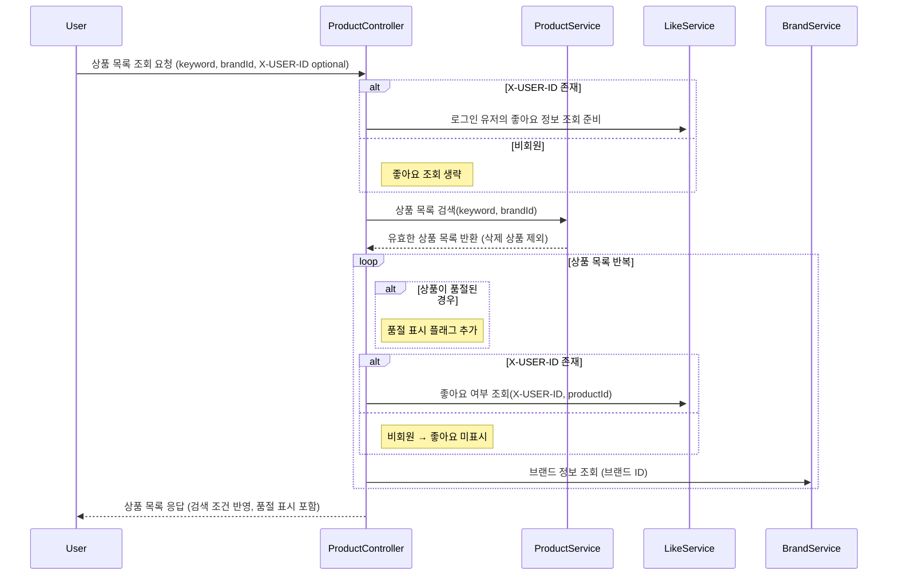

## 2. 상품 상세 조회

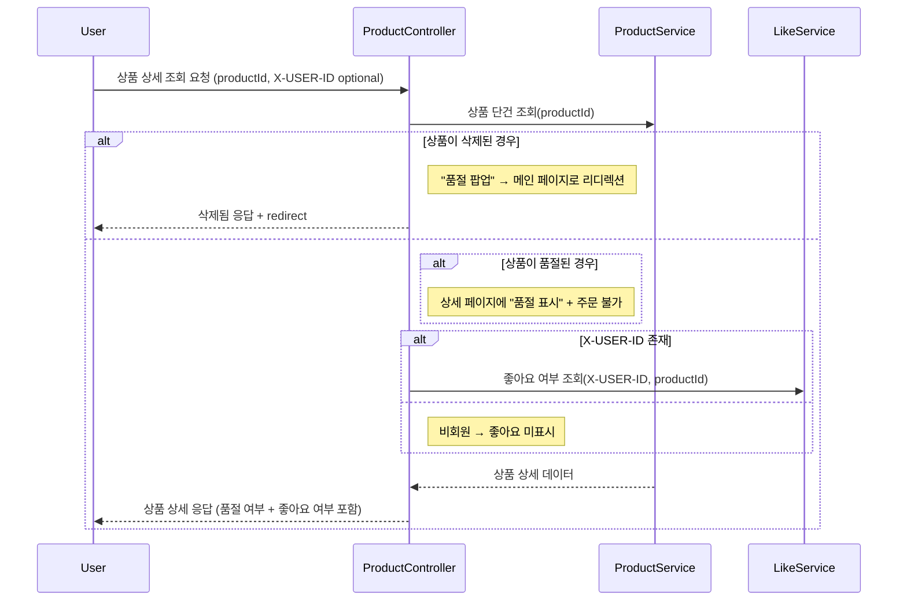

## 3. 브랜드 정보 조회

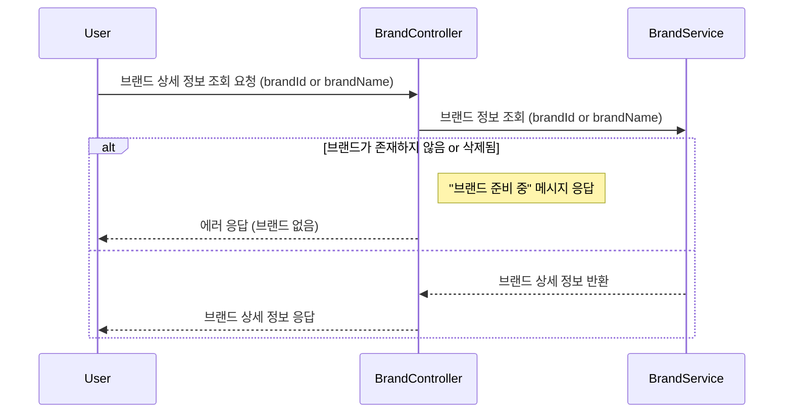

## 4. 브랜드별 상품 목록 조회

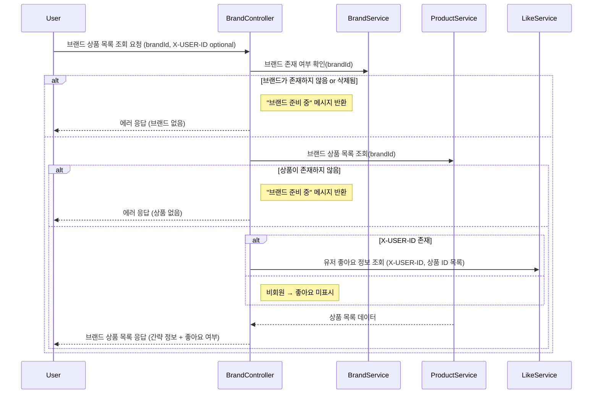

## 5. 브랜드별 상품 조회

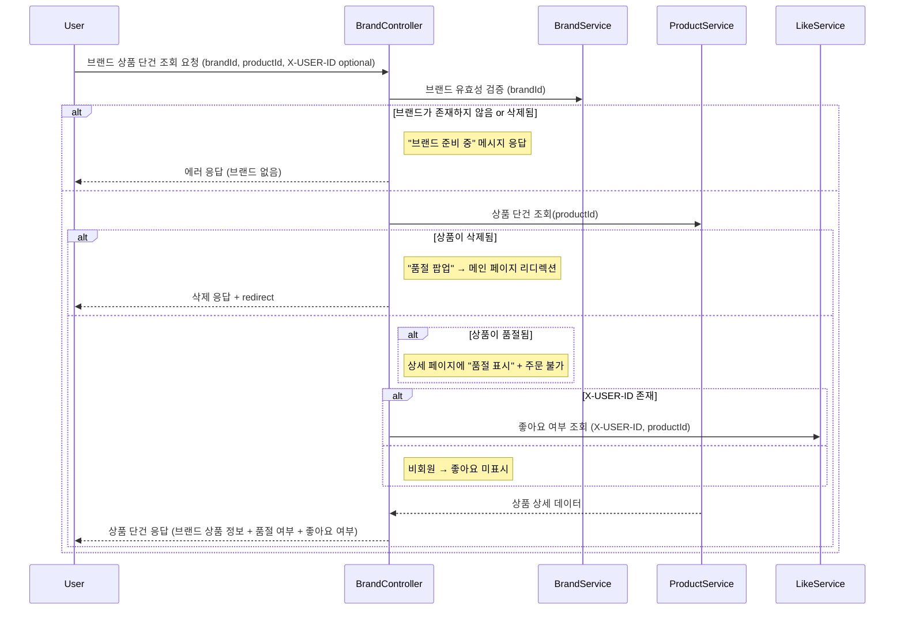

## 6. 상품 좋아요 등록

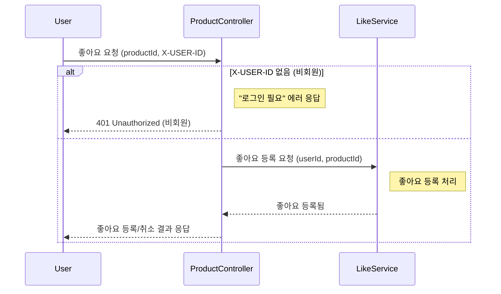

## 7. 상품 좋아요 취소

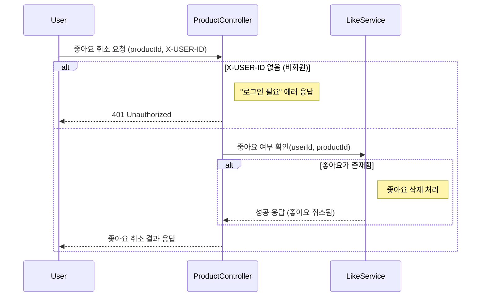

## 8. 좋아요 한 상품 목록 조회

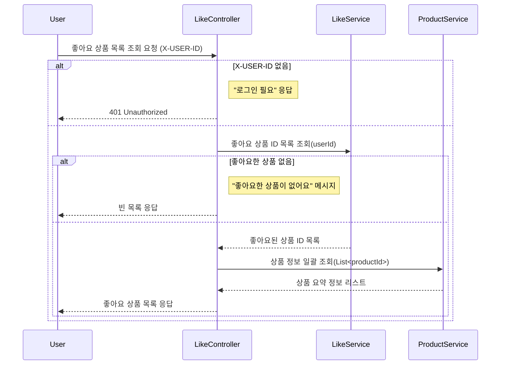

## 9. 주문 요청

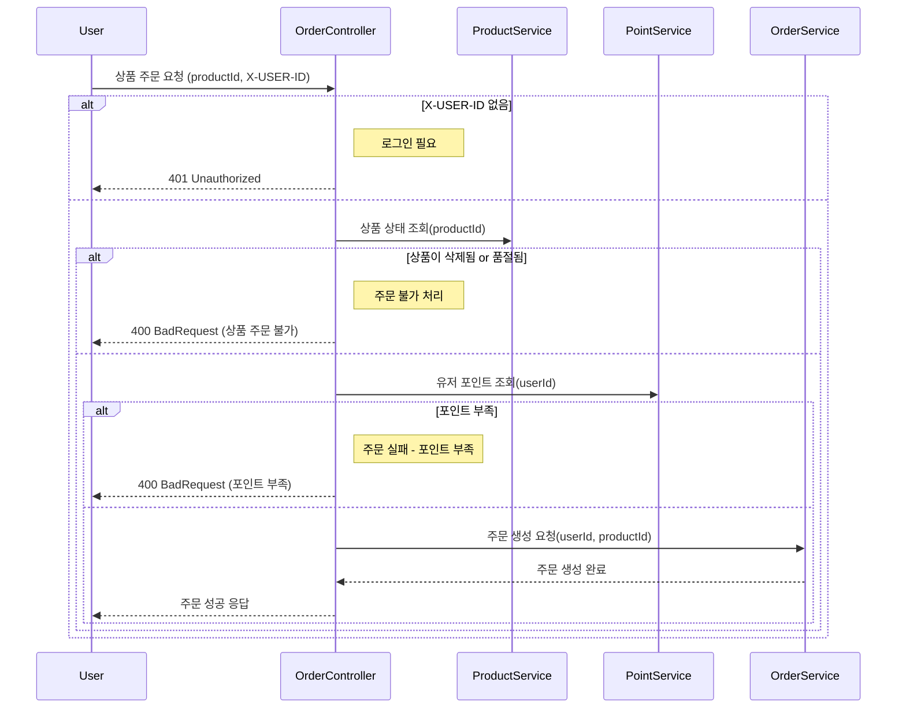

## 10. 주문 요청 목록 조회 

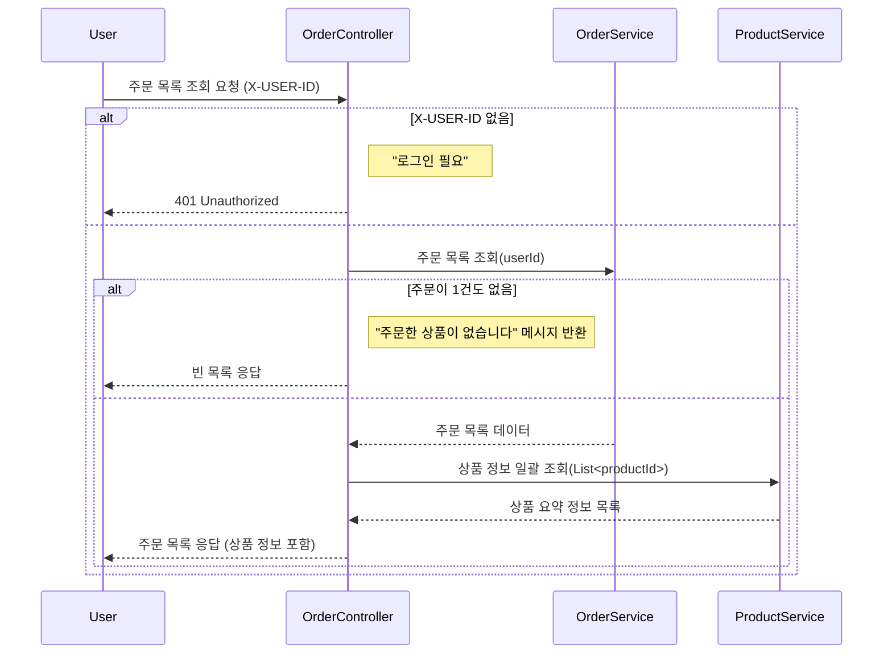

## 10. 주문 요청 상세 조회 

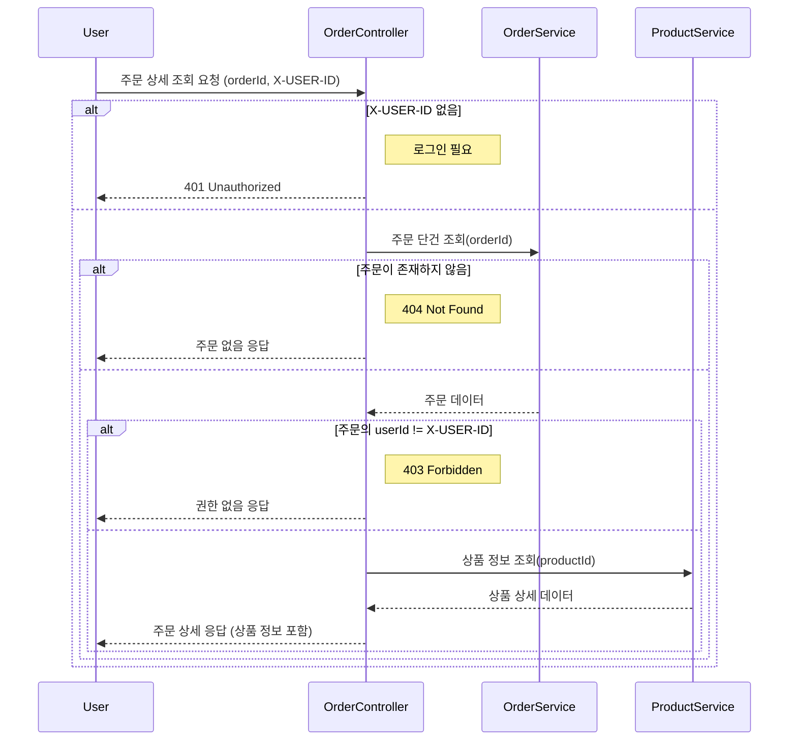