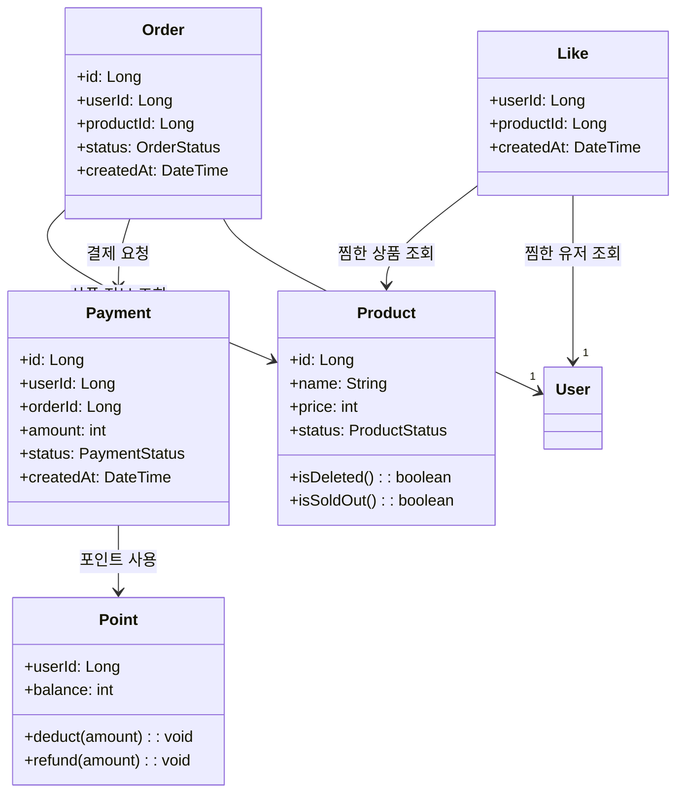

```mermaid
%% + : public
%% - : private
%% # : protected

classDiagram

%% ===== 주문 도메인 =====
    class Order {
        +id: Long
        +userId: Long
        +productId: Long
        +status: OrderStatus
        +createdAt: DateTime
    }

    class Product {
        +id: Long
        +name: String
        +price: int
        +status: ProductStatus
        +isDeleted(): boolean
        +isSoldOut(): boolean
    }

    class Point {
        +userId: Long
        +balance: int
        +deduct(amount): void
        +refund(amount): void
    }

    class Payment {
        +id: Long
        +userId: Long
        +orderId: Long
        +amount: int
        +status: PaymentStatus
        +createdAt: DateTime
    }

%% ===== 좋아요 도메인 =====
    class Like {
        +userId: Long
        +productId: Long
        +createdAt: DateTime
    }

%% ===== 관계 정의 =====
    Order --> Product : 상품 정보 조회
    Order --> Payment : 결제 요청
    Payment --> Point : 포인트 사용
    Like --> Product : 찜한 상품 조회
    Like --> "1" User : 찜한 유저 조회
    Order --> "1" User : 주문자 조회


```