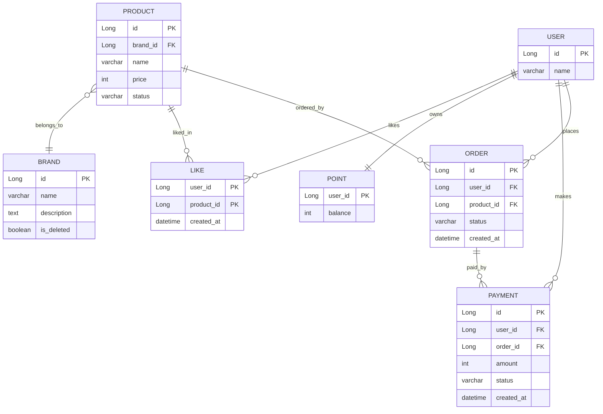

```mermaid
erDiagram

    USER {
        Long id PK
        varchar name
    }

    BRAND {
        Long id PK
        varchar name
        text description
        boolean is_deleted
    }

    PRODUCT {
        Long id PK
        Long brand_id FK
        varchar name
        int price
        varchar status
    }

    ORDER {
        Long id PK
        Long user_id FK
        Long product_id FK
        varchar status
        datetime created_at
    }

    PAYMENT {
        Long id PK
        Long user_id FK
        Long order_id FK
        int amount
        varchar status
        datetime created_at
    }

    POINT {
        Long user_id PK
        int balance
    }

    LIKE {
        Long user_id PK
        Long product_id PK
        datetime created_at
    }

    PRODUCT ||--o{ ORDER : ordered_by
    PRODUCT ||--o{ LIKE : liked_in
    PRODUCT }o--|| BRAND : belongs_to
    USER ||--o{ ORDER : places
    USER ||--o{ PAYMENT : makes
    USER ||--|| POINT : owns
    USER ||--o{ LIKE : likes
    ORDER ||--o{ PAYMENT : paid_by

```